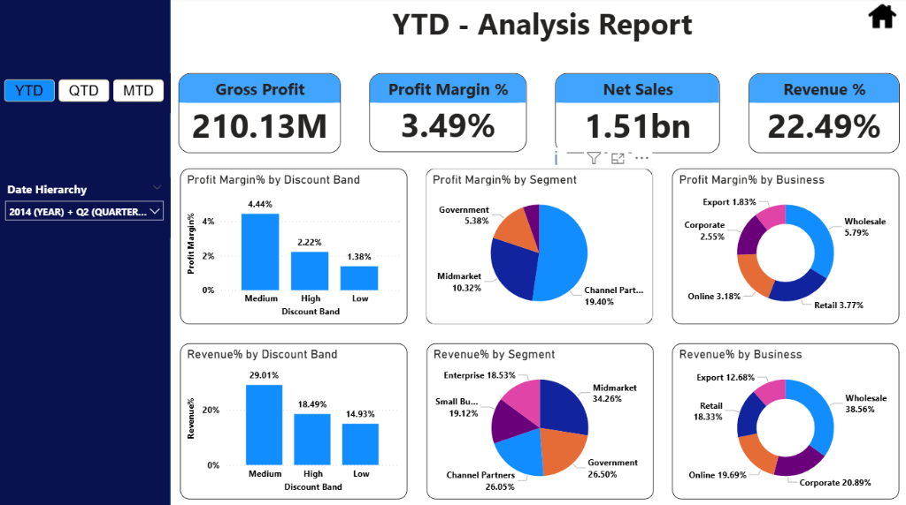
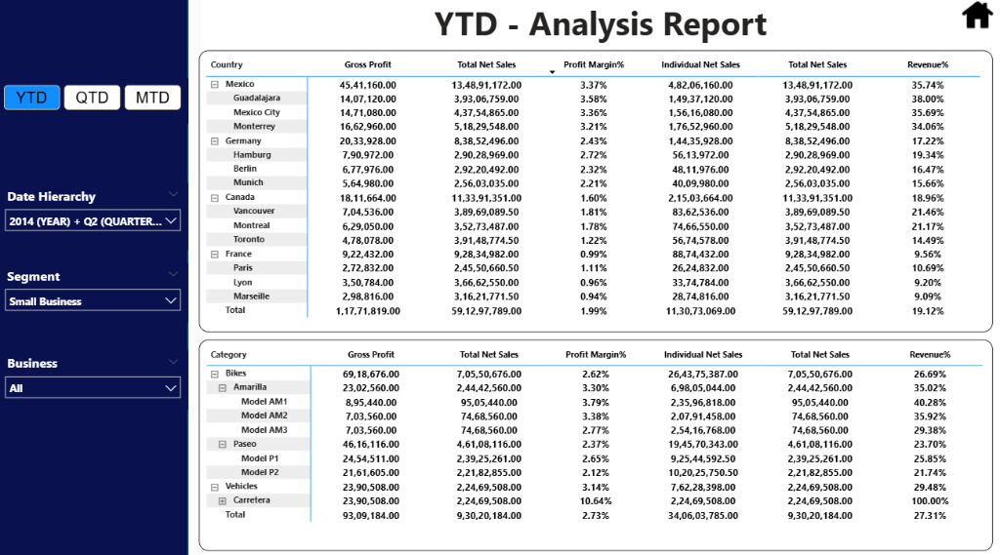

# Financial Analysis Project using Power BI

## Overview

This project presents a comprehensive financial analysis developed using Microsoft Power BI. It focuses on transforming raw financial data into meaningful insights through interactive dashboards and visualizations. 

The dashboard enables efficient exploration of financial performance, trends, and key indicators in a structured and user-friendly format.

---

## Dashboard Preview

### YTD Analysis Report — KPI & Charts View

### YTD Analysis Report — Detailed Table View

---

## Objectives

* To analyze financial performance using visual analytics
* To present data in an interactive and interpretable format
* To identify trends and patterns in financial metrics
* To support data-driven understanding through dashboards

---

## Methodology

The project follows a structured workflow:

1. **Data Integration**
   Financial data is imported and structured within Power BI.

2. **Data Transformation**
   Relevant fields are cleaned, formatted, and organized for analysis.

3. **Data Modeling**
   Relationships between data elements are established to enable accurate reporting.

4. **Visualization**
   Interactive dashboards are created using charts, tables, and KPIs to represent financial insights.

---

## Tools Used

* Microsoft Power BI

---

## Project File

* `FINANCIAL ANALYSIS PROJECT.pbix` — Main Power BI dashboard file

---

## Key Features

* Interactive dashboard interface
* Visual representation of financial performance
* KPI-based analysis
* Trend and comparative analysis

---

## Usage

1. Download the `.pbix` file
2. Open it using Microsoft Power BI Desktop
3. Explore the dashboard using filters and visuals

---
